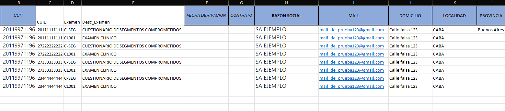
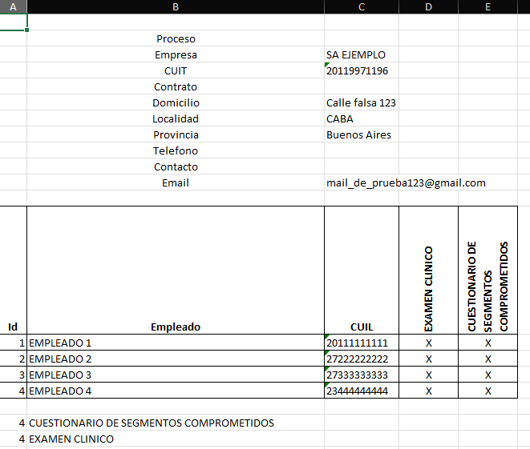

# Automatización de Exámenes Ocupacionales

## El problema

Las empresas de medicina laboral reciben planillas de derivación con filas repetidas por empleado y por tipo de estudio. Transformar eso manualmente en una planilla consolidada por empresa — con una columna por estudio y una X donde corresponde — tomaba tiempo considerable y era propenso a errores humanos.

Este script elimina ese proceso por completo.

## Qué hace

**Entrada:** archivo Excel con una fila por cada combinación empleado-estudio

**Salida:** planilla formateada con:
- Datos de empresa extraídos automáticamente (razón social, CUIT, domicilio, email)
- Una fila por empleado, ordenados alfabéticamente
- Una columna por tipo de estudio con X donde corresponde
- Formato profesional listo para entregar

> Desarrollado y usado en producción para una empresa de medicina laboral de Buenos Aires.

## Demo

**Entrada:**



**Salida generada automáticamente:**



## Instalación
```bash
pip install -r requirements.txt
```

`openpyxl` aplica formato profesional. `xlwings` ajusta el ancho de columnas automáticamente (opcional).

## Uso

Colocá los archivos `.xlsx` o `.xls` en la misma carpeta que `main.py` y ejecutá:
```bash
python main.py
```

Los archivos de salida se generan en la misma carpeta con el prefijo `output_sorted_`.

## Estructura del proyecto
```
├── main.py
├── requirements.txt
├── core/
│   ├── patients.py       ← extracción y procesamiento de empleados
│   ├── processor.py      ← orquestador del flujo completo
│   └── file_utils.py     ← búsqueda de archivos y autowidth
└── writers/
    ├── openpyxl_writer.py  ← escritura con formato profesional
    └── pandas_writer.py    ← escritura básica (fallback)
```

## Stack

Python · Pandas · OpenPyXL

---

Desarrollado por [Gustavo Plaza](https://github.com/plazagustavo)
